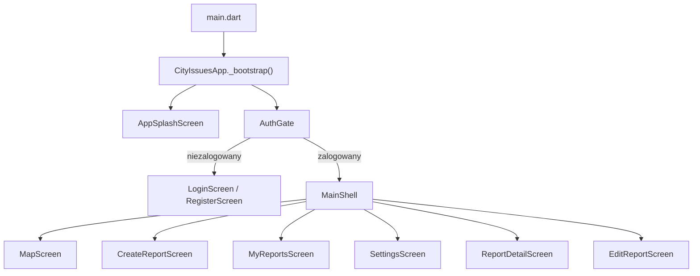

# Dokumentacja frontendu (Flutter)

Aplikacja mobilna **City Issues** — warstwa UI i logika po stronie klienta w katalogu `lib/`.

## Spis treści

- [Przegląd](#przegląd)
- [Uruchomienie lokalne](#uruchomienie-lokalne)
- [Architektura](#architektura)
- [Przepływ aplikacji](#przepływ-aplikacji)
- [Nawigacja](#nawigacja)
- [Moduły funkcjonalne](#moduły-funkcjonalne)
- [Warstwa serwisów](#warstwa-serwisów)
- [Powiązana dokumentacja](#powiązana-dokumentacja)

## Przegląd

Frontend jest aplikacją **Flutter** (Dart 3.11+) z układem **feature-first**: każda funkcja biznesowa ma własny katalog w `lib/features/`. Wspólna logika komunikacji z backendem, urządzeniem i cache offline znajduje się w `lib/services/`.

Główne założenia:

- UI nie wywołuje bezpośrednio GraphQL — korzysta z singletonów serwisów (`AuthService.instance`, `ReportService.instance` itd.).
- Stan sesji użytkownika pochodzi ze strumienia Firebase Auth (`AuthGate`).
- Główna nawigacja po zalogowaniu to `MainShell` z dolnym paskiem i zagnieżdżonym `Navigator`.
- Przy braku sieci aplikacja pokazuje dane z cache SQLite i kolejkuje wybrane operacje do synchronizacji.

## Uruchomienie lokalne

Szczegóły konfiguracji Firebase, Maps i emulatorów: [README główny](../../README.md#konfiguracja).

```bash
flutter pub get
flutter run
```

Emulator Firebase (opcjonalnie):

```bash
flutter run --dart-define=USE_FIREBASE_EMULATOR=true --dart-define=EMULATOR_HOST=<adres_lan>
```

## Architektura

```
┌─────────────────────────────────────────────────────────┐
│  lib/features/          ekrany, widgety, przewodnik     │
│       │                                                 │
│       ▼                                                 │
│  lib/services/          logika biznesowa, API, offline  │
│       │                                                 │
│       ├── dataconnect_generated/   (GraphQL SDK)        │
│       ├── firebase_auth / storage / messaging           │
│       └── offline/         SQLite + sync queue          │
└─────────────────────────────────────────────────────────┘
```

| Katalog | Odpowiedzialność |
|---------|------------------|
| `lib/app/` | `MaterialApp`, motyw (`theme.dart`), inicjalizacja Firebase i serwisów w `app.dart` |
| `lib/core/` | Stałe (`app_info.dart`), widgety wspólne (`offline_banner.dart`, `app_loading.dart`), mapowanie błędów dla użytkownika |
| `lib/features/` | Moduły UI pogrupowane po funkcji (auth, map, reports, settings, shell, onboarding, splash) |
| `lib/services/` | Singletony: auth, raporty, komentarze, storage, powiadomienia, preferencje, offline |
| `lib/dataconnect_generated/` | Kod wygenerowany z `dataconnect/` — nie edytować ręcznie |

Szczegóły warstw, bootstrapu i konwencji kodu: [architecture.md](architecture.md).

## Przepływ aplikacji



Podczas `_bootstrap()` inicjalizowane są m.in.:

1. Firebase (`FirebaseBootstrap.initialize()`)
2. `AuthService` — sesja i profil użytkownika
3. `AppPreferences` — motyw i akcent
4. `LocalDatabase` — SQLite pod cache offline
5. `ConnectivityService` — stan sieci
6. `NotificationService` — FCM i lokalne powiadomienia

## Nawigacja

### AuthGate

`lib/features/auth/auth_gate.dart` nasłuchuje `AuthService.instance.authStateChanges`. Po przywróceniu sesji pokazuje `MainShell`, w przeciwnym razie `LoginScreen`.

### MainShell

`lib/features/shell/main_shell.dart` to szkielet aplikacji po zalogowaniu:

- **IndexedStack** z czterema głównymi zakładkami: mapa, nowe zgłoszenie, moje zgłoszenia, ustawienia.
- **Zagnieżdżony Navigator** (`_shellNavigatorKey`) do ekranów szczegółów i edycji zgłoszenia.
- **OfflineBanner** u góry — reaguje na `ConnectivityService` i stan kolejki sync.
- **App tour** — onboarding z podświetlaniem elementów UI.
- **Polling** co 30 s oraz callback z `NotificationService` — odświeżanie listy zgłoszeń na mapie.

Mapowanie indeksów dolnego paska (kolejność wizualna vs. indeks w stacku) jest obsługiwane przez gettery `_navIndex` / `_stackIndex`.

## Moduły funkcjonalne

### `features/auth/`

| Plik | Opis |
|------|------|
| `auth_gate.dart` | Router sesji |
| `screens/login_screen.dart` | Logowanie Google |
| `screens/register_screen.dart` | Rejestracja Google |

Logowanie e-mail/hasło jest zaimplementowane w `AuthService`, ale nie jest wystawione w UI.

### `features/map/`

| Plik | Opis |
|------|------|
| `screens/map_screen.dart` | Mapa Google, markery, ładowanie kategorii i zgłoszeń |
| `widgets/map_category_filters.dart` | Chipsy filtrów kategorii |
| `widgets/report_marker_sheet.dart` | Bottom sheet po kliknięciu markera |

Mapa ładuje najpierw kategorie, potem zgłoszenia — zapobiega to pokazywaniu markerów bez poprawnych kolorów filtrów.

### `features/reports/`

| Plik | Opis |
|------|------|
| `screens/create_report_screen.dart` | Formularz nowego zgłoszenia |
| `screens/edit_report_screen.dart` | Edycja własnego zgłoszenia |
| `screens/my_reports_screen.dart` | Lista zgłoszeń użytkownika |
| `screens/report_detail_screen.dart` | Szczegóły, upvote, komentarze, akcje właściciela |
| `widgets/comments_section.dart` | Lista i formularz komentarzy |
| `widgets/upvote_button.dart` | Przycisk głosu wsparcia |
| `widgets/report_manage_actions.dart` | Edycja / usuwanie zgłoszenia |
| `widgets/report_location_picker.dart` | Wybór lokalizacji na mapie |
| `widgets/photo_viewer.dart` | Podgląd zdjęć |

### `features/settings/`

| Plik | Opis |
|------|------|
| `screens/settings_screen.dart` | Motyw, akcent, powiadomienia, pomoc, wylogowanie, usuwanie konta |
| `screens/about_screen.dart` | Informacje o aplikacji i zespole |
| `widgets/notification_settings_tile.dart` | Przełącznik push FCM |

### `features/onboarding/`

`app_tour.dart` — kroki przewodnika z GlobalKey do elementów mapy i ustawień.

### `features/splash/`

`app_splash_screen.dart` — ekran ładowania podczas bootstrapu.

## Warstwa serwisów

Pełna referencja metod, mapowanie na zapytania GraphQL i zachowanie offline:

**[`lib/services/README.md`](../../lib/services/README.md)**

Skrót modułów offline:

| Plik | Rola |
|------|------|
| `offline/local_database.dart` | SQLite: tabele `cache_entries`, `pending_operations` |
| `offline/offline_cache_store.dart` | Serializacja cache zgłoszeń, kategorii, komentarzy |
| `offline/connectivity_service.dart` | Nasłuch zmian połączenia (`connectivity_plus`) |
| `offline/offline_sync_service.dart` | Kolejka i wysyłka operacji po powrocie online |
| `offline/offline_exception.dart` | Wyjątek przy wymaganej sieci |

Szczegóły trybu offline: [offline.md](offline.md).  
Powiadomienia push: [notifications.md](notifications.md).

## Powiązana dokumentacja

| Dokument | Zawartość |
|----------|-----------|
| [architecture.md](architecture.md) | Bootstrap, motyw, testy widgetów, konwencje |
| [offline.md](offline.md) | Cache, kolejka sync, ograniczenia offline |
| [notifications.md](notifications.md) | FCM, token, Cloud Function, deep link do zgłoszenia |
| [../../README.md](../../README.md) | Konfiguracja projektu, CI, struktura repo |
| [../../lib/services/README.md](../../lib/services/README.md) | API serwisów |
| [../../integration_test/README.md](../../integration_test/README.md) | Testy E2E |
