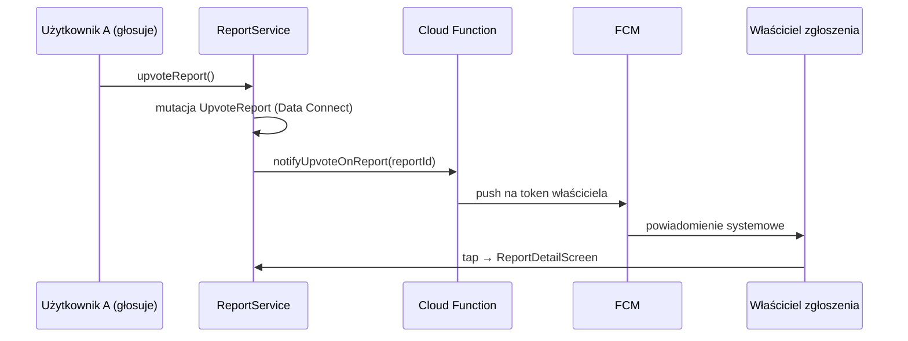

# Powiadomienia push (frontend)

Aplikacja wysyła powiadomienia **właścicielowi zgłoszenia**, gdy ktoś inny doda głos wsparcia (upvote). Implementacja opiera się na Firebase Cloud Messaging (FCM), lokalnych powiadomieniach na Androidzie oraz Cloud Function po stronie backendu.

## Przepływ

## NotificationService

Plik: `lib/services/notification_service.dart`

| Etap | Działanie |
|------|-----------|
| `initialize()` | Kanał Android, handlery FCM (foreground / background / terminated), integracja z `flutter_local_notifications` |
| `syncToken()` | Pobranie tokena FCM i zapis w profilu (`UpdateFcmToken` przez Data Connect) |
| `disablePushRegistration()` | Wyczyszczenie tokena w FCM i w bazie — używane przy wyłączeniu w ustawieniach |
| `notifyUpvoteOnReport()` | Wywołanie Cloud Function po udanym upvote (region `europe-central2`) |

Callbacki rejestrowane w `MainShell`:

- `setOnReportOpened` — nawigacja do `ReportDetailScreen` po kliknięciu powiadomienia,
- `setOnReportsChanged` — odświeżenie mapy i list po otrzymaniu push w tle.

## Ustawienia użytkownika

`lib/features/settings/widgets/notification_settings_tile.dart`:

- sprawdza zgodę systemową (`systemPermissionStatus`),
- włącza sync tokena lub wywołuje `disablePushRegistration`,
- stan przełącznika powiązany z `AppPreferences` / profilem.

## Polling jako uzupełnienie

`MainShell` uruchamia `Timer.periodic` (30 s), który odświeża zgłoszenia z serwera. Dzięki temu mapa aktualizuje się nawet bez interakcji z powiadomieniem (np. gdy push jest wyłączony).

## Wymagania konfiguracyjne

- Firebase Cloud Messaging włączone w projekcie,
- `google-services.json` z poprawną konfiguracją FCM,
- wdrożona Cloud Function `notifyUpvoteOnReport` w `functions/`,
- na urządzeniu: zgoda na powiadomienia (Android 13+).

Szczegóły backendu funkcji — katalog `functions/` i dokumentacja DevOps w repo.

## Powiązane pliki

| Plik | Rola |
|------|------|
| `lib/app/app.dart` | `NotificationService.instance.initialize()` w bootstrapie |
| `lib/features/shell/main_shell.dart` | Callbacki, polling, `syncToken()` przy starcie |
| `lib/services/report_service.dart` | Wywołanie `notifyUpvoteOnReport` po upvote |
| `lib/services/README.md` | Tabela metod `NotificationService` |
